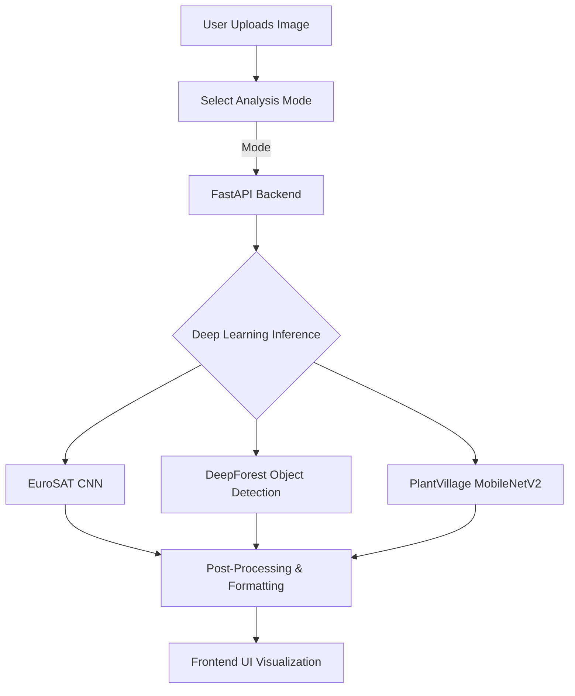

# 🌿 AI-Based Multi-Level Vegetation Analysis System

## 🎯 Project Overview
An **AI-driven modular web application** designed to provide comprehensive vegetation insights across different scales. From analyzing macro-level land usage via satellite imagery, to tracking micro-level individual tree geometries, to diagnosing single-plant species diseases, this system empowers data-driven environmental and agricultural monitoring.

## ✨ Key Features
- **3-in-1 Analysis Modes**: Seamlessly switch between Satellite Analysis, Tree Detection, and Leaf Classification.
- **Micro & Macro Views**: Support for aerial imagery processing alongside close-up botanical diagnostics.
- **Real-Time Visualizations**: Automatic bounding box generation and animated confidence overlays.
- **RESTful Architecture**: FastAPI-powered backend fully decoupled from the modern glassmorphic front-end UI.
- **Robust Pipeline**: Includes dynamic bounding-box thresholding, noise filtering, and high-precision probability distributions.

## ⚙️ System Architecture



## 🧩 Modules

### 🌍 1. Satellite Classification
- **Purpose**: Classify macro land-cover types and approximate vegetation density.
- **Model**: CNN trained on the EuroSAT Dataset.
- **Outputs**: Detects 10 classes (Forest, Residential, Highway, Industrial, etc.) and infers broad vegetation coverage ranges.

### 🌳 2. Tree Detection
- **Purpose**: Detect individual tree crowns from top-down aerial bounding boxes.
- **Model**: Pre-trained deep learning object detection model via `DeepForest`.
- **Outputs**: Generates bright bounding boxes over input imagery, calculates absolute tree counts, and derives localized vegetation coverage percentages.

### 🍃 3. Leaf-Based Plant Classification
- **Purpose**: Identify plant species and diagnose specific biological diseases from close-up leaf symptoms.
- **Model**: MobileNetV2 architecture trained natively on 38 distinct `PlantVillage` classes.
- **Outputs**: Returns the exact plant species and health condition formatted dynamically across an animated confidence scale.

## 💻 Tech Stack
- **Backend**: Python 3.10+, FastAPI, Uvicorn
- **AI/ML Core**: TensorFlow/Keras, DeepForest, OpenCV, NumPy, Pandas
- **Frontend**: Vanilla HTML5, CSS3 (Glassmorphism design system), ES6 JavaScript

## ⚙️ Installation & Setup

> **Note**: This repository uses Git LFS (Large File Storage) to manage the heavy `pre-trained model weights` inside the `models/` directory. Ensure you have Git LFS installed on your system.

1. **Clone the Repository**
   ```bash
   git clone https://github.com/KrishPitrola/vegetation-analysis.git
   cd vegetation-analysis
   git lfs pull
   ```

2. **Create & Activate a Virtual Environment**
   ```bash
   python -m venv venv
   # On Windows
   venv\Scripts\activate
   # On Mac/Linux
   source venv/bin/activate
   ```

3. **Install Dependencies**
   ```bash
   pip install -r requirements.txt
   ```

## 🚀 How to Run

### Method 1: Quick Start (Windows)
Simply double-click `start_server.bat` in the root directory to instantly launch and bind both the backend logic and the frontend visualizer.

### Method 2: Manual Start
1. **Start the FastAPI Backend**
   ```bash
   cd backend
   uvicorn main:app --reload
   ```
   *(Server binds locally to `http://127.0.0.1:8000`)*

2. **Start the Frontend**
   Open a new terminal context, navigate to the `frontend` folder, and proxy the UI over HTTP:
   ```bash
   cd frontend
   python -m http.server 5500
   ```
   *(UI is accessible locally at `http://localhost:5500`)*

## 📁 Project Structure

The repository is modularized for final academic and production evaluation:
```text
mini-project-DL/
├── backend/                  # FastAPI Application Core (Routing and HTTP schemas)
│   └── main.py              
├── frontend/                 # Interactive UI artifacts (Zero-dependency vanilla stack)
│   ├── index.html           
│   ├── script.js             
│   └── style.css            
├── models/                   # Centralized local model inference weights (LFS)
│   ├── leaf_model.keras     
│   └── model.h5             
├── training_archive/         # Isolated archive preserving datasets and pipelines
├── utils/                    # Shared scalable ML pipelines and model logic
│   ├── model.py              
│   ├── predict.py            
│   ├── satellite.py          
│   └── tree_detection.py     
├── README.md                 
├── requirements.txt          # Root-level requirements definition          
└── start_server.bat          # Execution wrapper
```

## 🔭 Future Scope
- **Geospatial API Integration**: Feed numerical outputs natively into QGIS or ArcGIS systems for regional ecological plotting.
- **Semantic Segmentation Upgrade**: Upgrade the Tree Detection anchor-box logic natively to pixel-perfect semantic segmentation masks using U-Net variations.
- **Hardware Acceleration Pipelines**: Transition the default multi-threaded CPU inference to ONNX bindings for robust multi-instance GPU acceleration.

---
**Author**: Krish Pitrola
